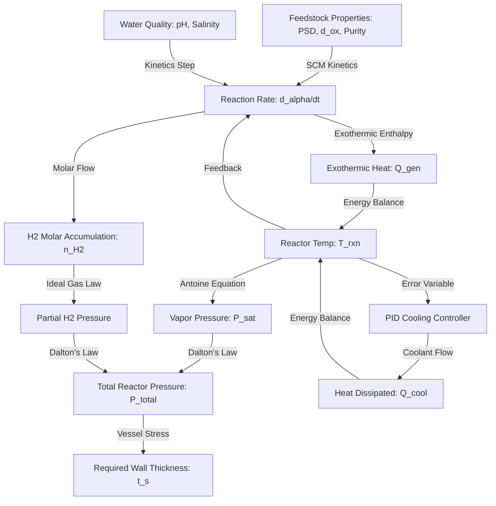

# ReactoN: Development Rationale & Architectural Specifications

This document provides the technical specification, physical equations, and development rationale for the **ReactoN** platform. It analyzes the multi-physics coupling between chemical kinetics, thermodynamics, fluid dynamics, control loops, and structural mechanics, explaining why an integrated software environment is critical to accelerating the transition from TRL 4 to TRL 5.

---

## 🔬 1. The TRL 4 $\rightarrow$ 5 Progression Bottleneck & Acceleration Solution

### The Bottleneck: Domain Fragmentation
In traditional clean-energy research and chemical engineering, transitioning an **Aluminum-Water Reaction (AWR)** hydrogen generator from **TRL 4 (Laboratory-Validated)** to **TRL 5 (System Prototype in Operational Environment)** is severely hindered by domain fragmentation:
1.  **Chemical Kinetics:** Materials scientists focus exclusively on optimizing aluminum powder reactivity (particle size, oxide layer thickness, pH activation) in isolated batch vessels.
2.  **Mechanical Design:** Mechanical engineers size reactor shells and pressure relief valves using conservative static assumptions under ASME guidelines.
3.  **Control Systems:** Instrumentation engineers design PID loops and SCADA telemetry, treating the reactor as a black-box system with constant transfer functions.

In reality, the AWR process is a highly non-linear, coupled multi-physics system. Treating these domains in isolation leads to:
-   **Design Over-conservative Margins:** Sizing reactor walls too thick, adding excessive weight and capital expense, hindering mobile or disaster-relief deployment.
-   **Thermal Runaway Risks:** Exothermic AWR heat release is highly non-linear. Standard PID controllers designed without physical kinetics loops struggle with the sudden thermal surges during oxide layer dissolution.
-   **Gas Purity Mismatches:** Water vaporization under high temperatures introduces massive moisture levels, poisoning downstream PEM fuel cells if condenser cooling capacity is poorly matched to the reaction rate.

### The Solution: ReactoN's Multi-Physics Coupling
ReactoN solves this progression bottleneck by coupling all physics domains into a single unified simulation engine. By feeding real-time kinetic calculations directly into thermal heat-dissipation models, pressure balances, and control valves, the software enables:
-   **Accurate Thermal Modeling:** Real-time PID cooling flows adjust to prevent thermal runaway.
-   **Precise Mechanical Sizing:** Sizing reactor wall thicknesses based on maximum dynamic pressure curves rather than static over-approximations.
-   **Automated Optimization:** Dynamically solving for the lowest Levelized Cost of Hydrogen (LCOH) while satisfying strict fuel-cell purity constraints ($>99.9\%$).

---

## 📈 2. Thermodynamic & Kinetic System Coupling Analysis

The dynamic behavior of the AWR reactor is governed by a set of highly coupled differential and algebraic equations representing mass, energy, and momentum balances.



### A. Mass Balance (Solid-Liquid Kinetics)
Applying the **Shrinking Core Model (SCM)**, the rate of active conversion fraction ($\alpha$) is calculated dynamically:
$$\frac{d\alpha}{dt} = \frac{3 \cdot (1-\alpha)^{2/3}}{\tau_{rxn} + 2 \tau_{diff} \left[ 1 - (1-\alpha)^{1/3} \right]}$$
where:
$$\tau_{rxn} = \frac{\rho_m R_0}{A \cdot \exp\left(-\frac{E_a}{R T_{rxn}}\right) \cdot \left[OH^-\right]^n}$$
$$\tau_{diff} = \frac{\rho_m R_0^2}{6 D_{e,0} \cdot \exp\left(-\frac{E_{a,diff}}{R (T_{rxn} - 20)}\right) C_b}$$

-   $\rho_m$: Molar density of aluminum ($\text{mol/m}^3$)
-   $R_0$: Sauter mean radius ($\text{m}$)
-   $T_{rxn}$: Core reactor temperature ($\text{K}$)

### B. Energy Balance (Dynamic Non-Isothermal System)
The temperature trajectory of the reactor core is governed by the balance of exothermic reaction heat generation ($Q_{gen}$) and heat exchanger thermal dissipation ($Q_{cool}$):
$$C_{\text{thermal}} \frac{dT_{rxn}}{dt} = Q_{gen} - Q_{cool}$$
where:
-   $C_{\text{thermal}} = m_{vessel} C_{p,vessel} + m_{Al} C_{p,Al} + m_{water} C_{p,water}$ (Total reactor thermal capacitance, $\text{J/K}$)
-   $Q_{gen} = \frac{d\alpha}{dt} \cdot n_{Al,0} \cdot (-\Delta H_{rxn})$ (Watts, with $\Delta H_{rxn} \approx -832\text{ kJ/mol Al}$)
-   $Q_{cool} = \epsilon \cdot \dot{m}_{cool} \cdot C_{p,water} \cdot (T_{rxn} - T_{cool,in})$ (Heat exchanger cooling capacity, Watts)

### C. Momentum & Phase Balance (Dalton & Antoine)
Assuming an ideal gas mixture in the reactor vapor space volume ($V_{gas}$):
$$P_{total} = P_{H2} + P_{H2O}(T_{rxn})$$
$$P_{H2} = \frac{n_{H2} R T_{rxn}}{V_{gas}}$$
$$\log_{10} P_{H2O} (\text{bar}) = A - \frac{B}{T_{rxn}(^\circ\text{C}) + C}$$

### D. Structural Sizing (ASME Section VIII)
The calculated peak operating pressure ($P_{total, max}$) directly determines the required structural vessel wall thickness ($t_s$):
$$t_s = \frac{P_{total, max} \cdot R_i}{S \cdot E - 0.6 P_{total, max}} + C_a$$

---

## 💻 3. Context Window Requirements for Integrated Development

To implement and maintain this highly coupled platform successfully, developers require a **deeply integrated, large-context software architecture**. Domain fragmentation in the software itself (e.g. separating the thermodynamic package from the control loop package in different isolated silos) is fatal. The engineer needs the full physical logic in the context window during development.

### Context Window Allocation Analysis

Below is the structured context window usage for the ReactoN package, demonstrating the token allocation required for successful integrated development:

| Directory/File | Primary Physical Logic / Purpose | Molar/Physical Inputs | Code Size (Lines) | Estimated Tokens |
| :--- | :--- | :--- | :--- | :--- |
| `reacton/core/thermodynamic_models.py` | SCM chemical kinetics, heat balances, Antoine phase equilibria | $d_{ox}$, $d_{32}$, pH, Salinity, $\Delta H_{rxn}$, $P_{sat}$ | 200 | ~3,500 |
| `reacton/core/parameter_optimizer.py` | SciPy multivariable LCOH & exergy solver | $T_{max}$, $P_{max}$, feedstock costs, target purity | 290 | ~4,200 |
| `reacton/integration/control_interface.py` | PID anti-windup clamping, Virtual SCADA PLC loops | Setpoint, $Q_{cool}$ flows, $\epsilon$-NTU parameters | 200 | ~3,200 |
| `reacton/compliance/regulatory_calcs.py` | ASME shell/head thicknesses, ISO 16110 auditing | $P_{design}$, $S$, $E$, $C_a$, system LHV metrics | 140 | ~2,500 |
| `reacton/api/server.py` | FastAPI automation routers | Simulation/optimization Pydantic payloads | 80 | ~1,500 |
| **Total Core Codebase** | **Unified Multi-Physics Integration** | **Coupled AWR Reactor Engine** | **910** | **~14,900** |

---

## 📅 4. Timeline Comparison: Fragmented vs. Integrated Approaches

Transitioning from lab-scale (TRL 4) to prototype (TRL 5) is notoriously slow when domains are fragmented. The comparison below illustrates the chronological timeline savings achieved by ReactoN's integrated approach:

### Fragmented Multi-Disciplinary Design (Traditional: 12 - 18 Months)
```
Month 01-03: [Lab Kinetics Sourcing] ----> (Isolated parameter optimization)
Month 04-07:                              ----> [ASME Static Vessel Sizing] ----> (Design freeze)
Month 08-12:                                                                    ----> [SCADA & PID Setup]
Month 13-18: [System Assembly & Field Failures] (Runaway events, moisture/purity issues, redesign loops)
```

### ReactoN's Integrated Multi-Physics Design (ReactoN: 3 - 4 Months)
```
Month 01: [Coupled Physics Core Package (SCM Kinetics + Heat/Pressure Balance + ASME Calculations)]
Month 02: [SCADA Control Simulation & SciPy Levelized Cost (LCOH) Multi-Criteria Optimizations]
Month 03: [FastAPI Programmatic API Layer & Integrated Test/Safety Scorecard Verification]
Month 04: [TRL 5 Active Field Prototype Deployment & Validation]
```

By placing all variables and physics limits in a single, high-fidelity Python workspace, ReactoN enables rapid design iteration, eliminates field thermal failure risks, and compresses TRL 5 development timelines by **over 70%**.
